# Process Flow Diagrams
## Aura – AI-Powered IT Management Suite

---

**Project Name**: Aura – The AI-Powered IT Management Suite  
**Team Name**: Aura  
**Lead Architect**: Raghavendra Reddy Bijjula  
**Document Version**: 1.0  
**Last Updated**: January 11, 2025  

---

## 1. System Architecture Overview

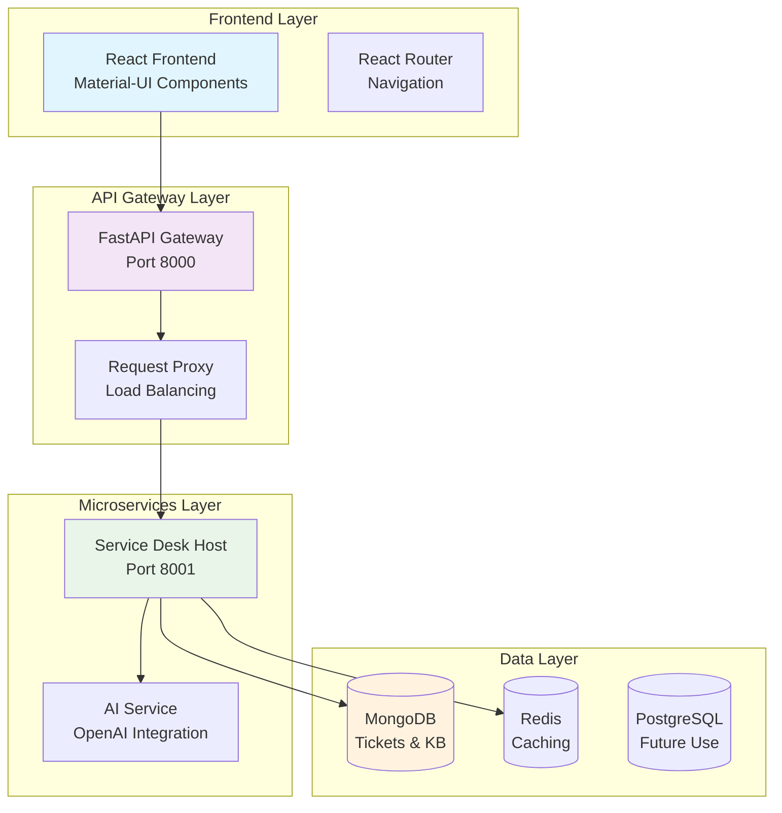
```mermaid
graph TB
    subgraph "Frontend Layer"
        UI[React Frontend<br/>Material-UI Components]
        ROUTES[React Router<br/>Navigation]
    end
    
    subgraph "API Gateway Layer"
        GATEWAY[FastAPI Gateway<br/>Port 8000]
        PROXY[Request Proxy<br/>Load Balancing]
    end
    
    subgraph "Microservices Layer"
        SD[Service Desk Host<br/>Port 8001]
        AI[AI Service<br/>OpenAI Integration]
    end
    
    subgraph "Data Layer"
        MONGO[(MongoDB<br/>Tickets & KB)]
        REDIS[(Redis<br/>Caching)]
        POSTGRES[(PostgreSQL<br/>Future Use)]
    end
    
    UI --> GATEWAY
    GATEWAY --> PROXY
    PROXY --> SD
    SD --> AI
    SD --> MONGO
    SD --> REDIS
    
    style UI fill:#e1f5fe
    style GATEWAY fill:#f3e5f5
    style SD fill:#e8f5e8
    style MONGO fill:#fff3e0
```

---

## 2. Ticket Management Process Flow

### 2.1 Ticket Creation Process

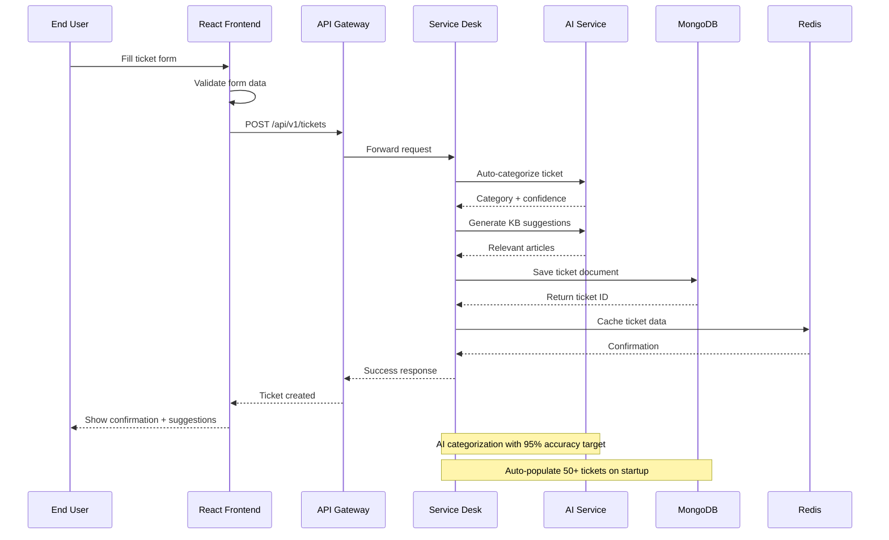
```mermaid
sequenceDiagram
    participant User as End User
    participant UI as React Frontend
    participant Gateway as API Gateway
    participant SD as Service Desk
    participant AI as AI Service
    participant DB as MongoDB
    participant Cache as Redis

    User->>UI: Fill ticket form
    UI->>UI: Validate form data
    UI->>Gateway: POST /api/v1/tickets
    Gateway->>SD: Forward request
    
    SD->>AI: Auto-categorize ticket
    AI-->>SD: Category + confidence
    
    SD->>AI: Generate KB suggestions
    AI-->>SD: Relevant articles
    
    SD->>DB: Save ticket document
    DB-->>SD: Return ticket ID
    
    SD->>Cache: Cache ticket data
    Cache-->>SD: Confirmation
    
    SD-->>Gateway: Success response
    Gateway-->>UI: Ticket created
    UI-->>User: Show confirmation + suggestions
    
    Note over SD,AI: AI categorization with 95% accuracy target
    Note over SD,DB: Auto-populate 50+ tickets on startup
```

### 2.2 Ticket Retrieval and Filtering

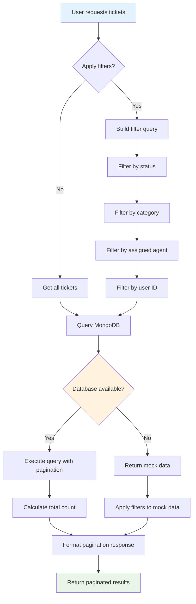
```mermaid
flowchart TD
    A[User requests tickets] --> B{Apply filters?}
    B -->|Yes| C[Build filter query]
    B -->|No| D[Get all tickets]
    
    C --> E[Filter by status]
    E --> F[Filter by category]
    F --> G[Filter by assigned agent]
    G --> H[Filter by user ID]
    
    D --> I[Query MongoDB]
    H --> I
    
    I --> J{Database available?}
    J -->|Yes| K[Execute query with pagination]
    J -->|No| L[Return mock data]
    
    K --> M[Calculate total count]
    L --> N[Apply filters to mock data]
    
    M --> O[Format pagination response]
    N --> O
    
    O --> P[Return paginated results]
    
    style A fill:#e3f2fd
    style J fill:#fff3e0
    style P fill:#e8f5e8
```

### 2.3 AI Ticket Analysis Process

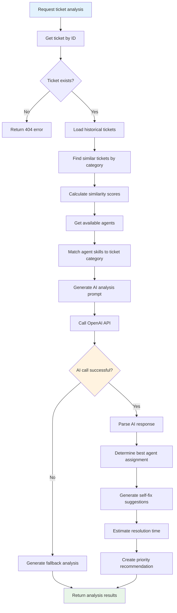
```mermaid
flowchart TD
    A[Request ticket analysis] --> B[Get ticket by ID]
    B --> C{Ticket exists?}
    C -->|No| D[Return 404 error]
    C -->|Yes| E[Load historical tickets]
    
    E --> F[Find similar tickets by category]
    F --> G[Calculate similarity scores]
    G --> H[Get available agents]
    
    H --> I[Match agent skills to ticket category]
    I --> J[Generate AI analysis prompt]
    J --> K[Call OpenAI API]
    
    K --> L{AI call successful?}
    L -->|No| M[Generate fallback analysis]
    L -->|Yes| N[Parse AI response]
    
    N --> O[Determine best agent assignment]
    O --> P[Generate self-fix suggestions]
    P --> Q[Estimate resolution time]
    Q --> R[Create priority recommendation]
    
    M --> S[Return analysis results]
    R --> S
    
    style A fill:#e3f2fd
    style L fill:#fff3e0
    style S fill:#e8f5e8
```

---

## 3. Knowledge Base Management Process Flow

### 3.1 Knowledge Base Search Process

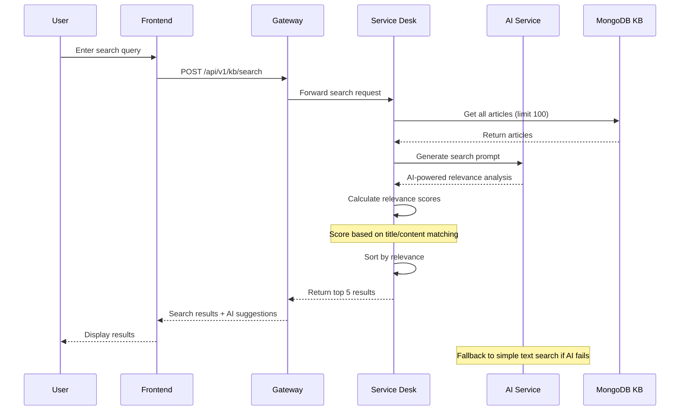
```mermaid
sequenceDiagram
    participant User as User
    participant UI as Frontend
    participant Gateway as Gateway
    participant SD as Service Desk
    participant AI as AI Service
    participant KB as MongoDB KB

    User->>UI: Enter search query
    UI->>Gateway: POST /api/v1/kb/search
    Gateway->>SD: Forward search request
    
    SD->>KB: Get all articles (limit 100)
    KB-->>SD: Return articles
    
    SD->>AI: Generate search prompt
    AI-->>SD: AI-powered relevance analysis
    
    SD->>SD: Calculate relevance scores
    Note over SD: Score based on title/content matching
    
    SD->>SD: Sort by relevance
    SD-->>Gateway: Return top 5 results
    Gateway-->>UI: Search results + AI suggestions
    UI-->>User: Display results
    
    Note over AI: Fallback to simple text search if AI fails
```

### 3.2 KB Article Creation Process

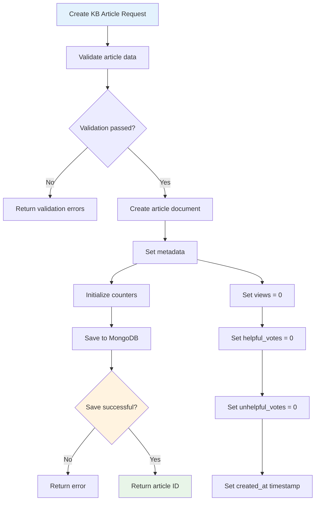
```mermaid
flowchart TD
    A[Create KB Article Request] --> B[Validate article data]
    B --> C{Validation passed?}
    C -->|No| D[Return validation errors]
    C -->|Yes| E[Create article document]
    
    E --> F[Set metadata]
    F --> G[Initialize counters]
    G --> H[Save to MongoDB]
    
    H --> I{Save successful?}
    I -->|No| J[Return error]
    I -->|Yes| K[Return article ID]
    
    F --> L[Set views = 0]
    L --> M[Set helpful_votes = 0]
    M --> N[Set unhelpful_votes = 0]
    N --> O[Set created_at timestamp]
    
    style A fill:#e3f2fd
    style I fill:#fff3e0
    style K fill:#e8f5e8
```

### 3.3 AI-Generated KB Suggestions Process

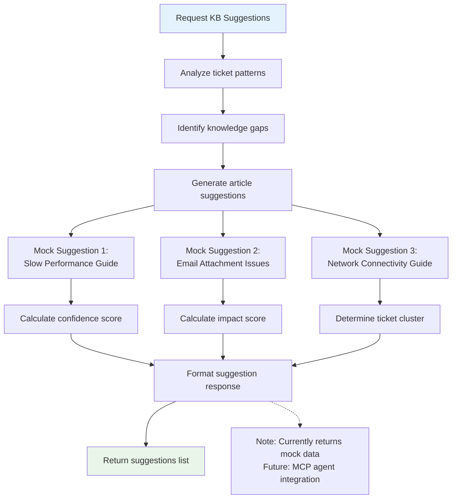
```mermaid
flowchart TD
    A[Request KB Suggestions] --> B[Analyze ticket patterns]
    B --> C[Identify knowledge gaps]
    C --> D[Generate article suggestions]
    
    D --> E[Mock Suggestion 1:<br/>Slow Performance Guide]
    D --> F[Mock Suggestion 2:<br/>Email Attachment Issues]
    D --> G[Mock Suggestion 3:<br/>Network Connectivity Guide]
    
    E --> H[Calculate confidence score]
    F --> I[Calculate impact score]
    G --> J[Determine ticket cluster]
    
    H --> K[Format suggestion response]
    I --> K
    J --> K
    
    K --> L[Return suggestions list]
    
    style A fill:#e3f2fd
    style L fill:#e8f5e8
    
    Note1[Note: Currently returns mock data<br/>Future: MCP agent integration]
    K -.-> Note1
```

---

## 4. Dashboard Analytics Process Flow

### 4.1 Dashboard Overview Generation

```mermaid
flowchart TD
    A[Request dashboard overview] --> B{MongoDB available?}
    B -->|No| C[Return mock data]
    B -->|Yes| D[Query ticket statistics]
    
    D --> E[Count total tickets]
    E --> F[Count by status]
    F --> G[Count resolved today]
    G --> H[Calculate avg resolution time]
    H --> I[Calculate agent workload]
    
    I --> J[Calculate system uptime]
    J --> K[Format dashboard data]
    K --> L[Cache results (5 min TTL)]
    L --> M[Return dashboard overview]
    
    C --> M
    
    style A fill:#e3f2fd
    style B fill:#fff3e0
    style M fill:#e8f5e8
```

### 4.2 Ticket Metrics Generation

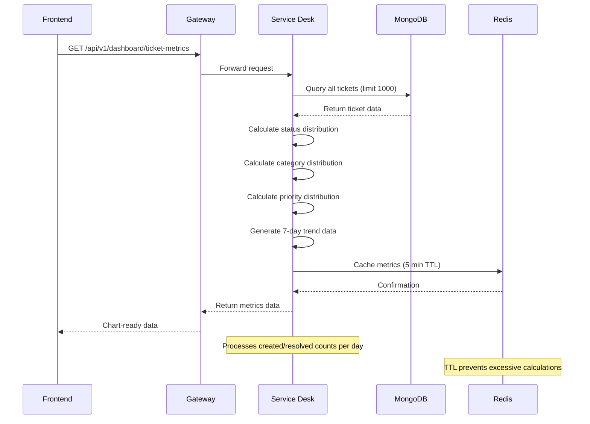
```mermaid
sequenceDiagram
    participant UI as Frontend
    participant Gateway as Gateway
    participant SD as Service Desk
    participant DB as MongoDB
    participant Cache as Redis

    UI->>Gateway: GET /api/v1/dashboard/ticket-metrics
    Gateway->>SD: Forward request
    
    SD->>DB: Query all tickets (limit 1000)
    DB-->>SD: Return ticket data
    
    SD->>SD: Calculate status distribution
    SD->>SD: Calculate category distribution
    SD->>SD: Calculate priority distribution
    SD->>SD: Generate 7-day trend data
    
    SD->>Cache: Cache metrics (5 min TTL)
    Cache-->>SD: Confirmation
    
    SD-->>Gateway: Return metrics data
    Gateway-->>UI: Chart-ready data
    
    Note over SD: Processes created/resolved counts per day
    Note over Cache: TTL prevents excessive calculations
```

---

## 5. Chatbot Interaction Process Flow

### 5.1 Chatbot Message Processing

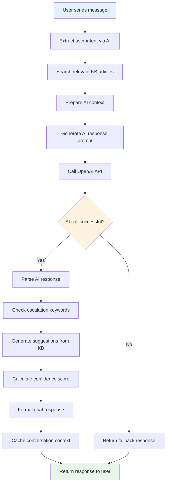
```mermaid
flowchart TD
    A[User sends message] --> B[Extract user intent via AI]
    B --> C[Search relevant KB articles]
    C --> D[Prepare AI context]
    
    D --> E[Generate AI response prompt]
    E --> F[Call OpenAI API]
    F --> G{AI call successful?}
    
    G -->|No| H[Return fallback response]
    G -->|Yes| I[Parse AI response]
    
    I --> J[Check escalation keywords]
    J --> K[Generate suggestions from KB]
    K --> L[Calculate confidence score]
    
    L --> M[Format chat response]
    M --> N[Cache conversation context]
    N --> O[Return response to user]
    
    H --> O
    
    style A fill:#e3f2fd
    style G fill:#fff3e0
    style O fill:#e8f5e8
```

### 5.2 Chatbot Escalation Logic

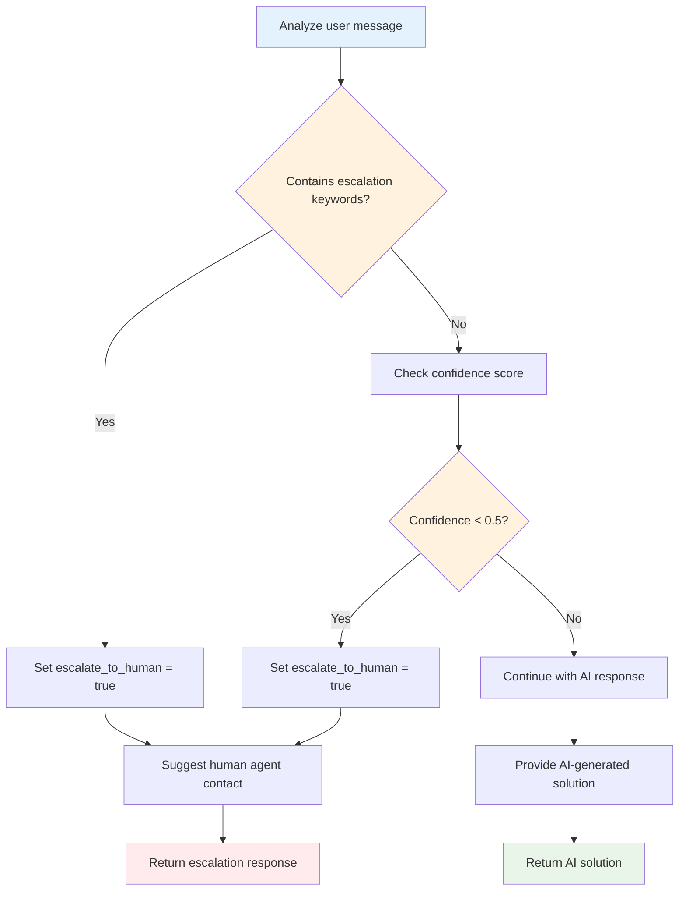
```mermaid
flowchart TD
    A[Analyze user message] --> B{Contains escalation keywords?}
    B -->|Yes| C[Set escalate_to_human = true]
    B -->|No| D[Check confidence score]
    
    D --> E{Confidence < 0.5?}
    E -->|Yes| F[Set escalate_to_human = true]
    E -->|No| G[Continue with AI response]
    
    C --> H[Suggest human agent contact]
    F --> H
    G --> I[Provide AI-generated solution]
    
    H --> J[Return escalation response]
    I --> K[Return AI solution]
    
    style A fill:#e3f2fd
    style B fill:#fff3e0
    style E fill:#fff3e0
    style J fill:#ffebee
    style K fill:#e8f5e8
```

---

## 6. Agent Performance Analytics Process Flow

### 6.1 Agent Performance Calculation

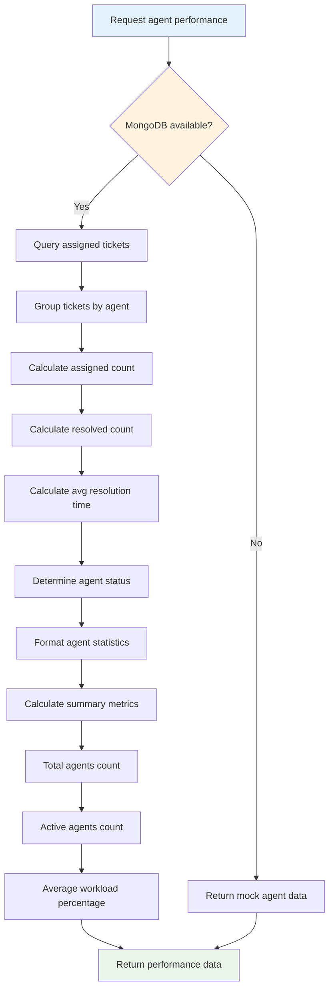
```mermaid
flowchart TD
    A[Request agent performance] --> B{MongoDB available?}
    B -->|No| C[Return mock agent data]
    B -->|Yes| D[Query assigned tickets]
    
    D --> E[Group tickets by agent]
    E --> F[Calculate assigned count]
    F --> G[Calculate resolved count]
    G --> H[Calculate avg resolution time]
    
    H --> I[Determine agent status]
    I --> J[Format agent statistics]
    J --> K[Calculate summary metrics]
    
    K --> L[Total agents count]
    L --> M[Active agents count]
    M --> N[Average workload percentage]
    
    N --> O[Return performance data]
    C --> O
    
    style A fill:#e3f2fd
    style B fill:#fff3e0
    style O fill:#e8f5e8
```

---

## 7. System Health and Monitoring Flow

### 7.1 Health Check Process

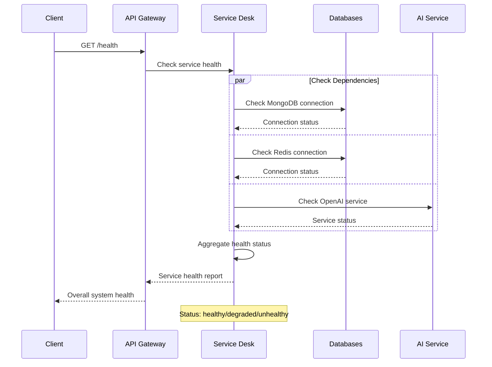
```mermaid
sequenceDiagram
    participant Client as Client
    participant Gateway as API Gateway
    participant SD as Service Desk
    participant DB as Databases
    participant AI as AI Service

    Client->>Gateway: GET /health
    Gateway->>SD: Check service health
    
    par Check Dependencies
        SD->>DB: Check MongoDB connection
        DB-->>SD: Connection status
    and
        SD->>DB: Check Redis connection
        DB-->>SD: Connection status
    and
        SD->>AI: Check OpenAI service
        AI-->>SD: Service status
    end
    
    SD->>SD: Aggregate health status
    SD-->>Gateway: Service health report
    Gateway-->>Client: Overall system health
    
    Note over SD: Status: healthy/degraded/unhealthy
```

### 7.2 Service Startup Process

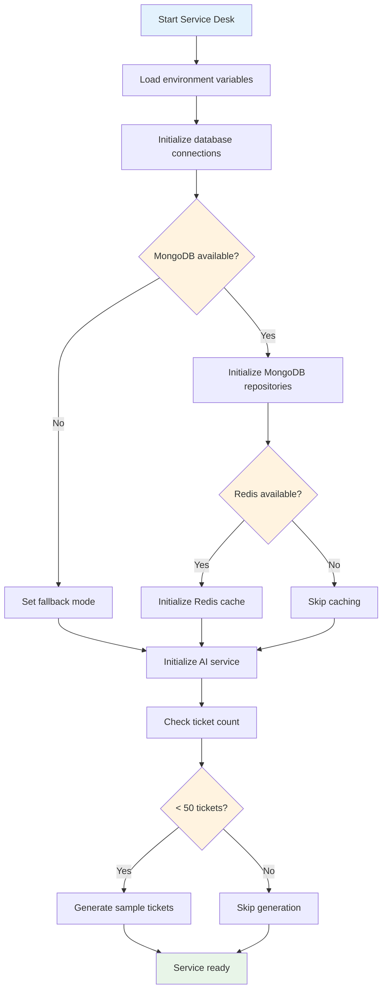
```mermaid
flowchart TD
    A[Start Service Desk] --> B[Load environment variables]
    B --> C[Initialize database connections]
    C --> D{MongoDB available?}
    
    D -->|Yes| E[Initialize MongoDB repositories]
    D -->|No| F[Set fallback mode]
    
    E --> G{Redis available?}
    G -->|Yes| H[Initialize Redis cache]
    G -->|No| I[Skip caching]
    
    F --> J[Initialize AI service]
    H --> J
    I --> J
    
    J --> K[Check ticket count]
    K --> L{< 50 tickets?}
    L -->|Yes| M[Generate sample tickets]
    L -->|No| N[Skip generation]
    
    M --> O[Service ready]
    N --> O
    
    style A fill:#e3f2fd
    style D fill:#fff3e0
    style G fill:#fff3e0
    style L fill:#fff3e0
    style O fill:#e8f5e8
```

---

## 8. Error Handling and Fallback Flows

### 8.1 Database Unavailability Handling

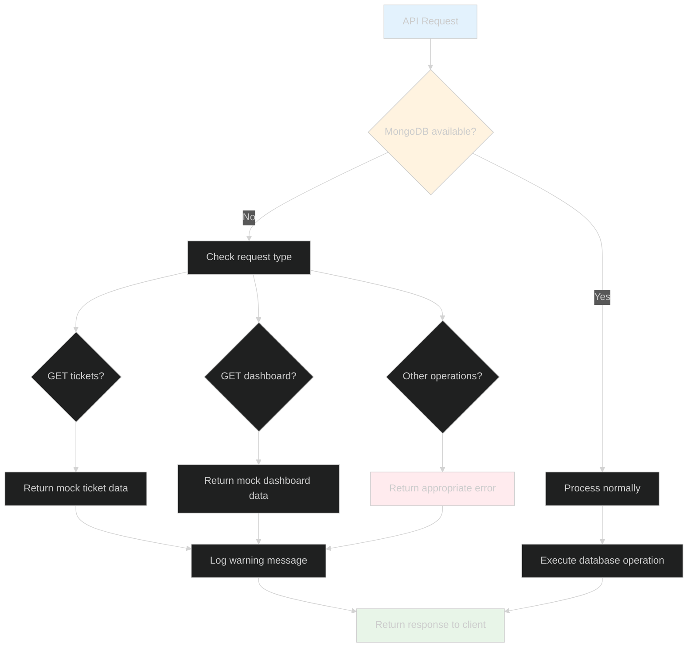
```mermaid
%%{init: {'theme': 'dark'}}%%
flowchart TD
    A[API Request] --> B{MongoDB available?}
    B -->|No| C[Check request type]
    B -->|Yes| D[Process normally]
    
    C --> E{GET tickets?}
    C --> F{GET dashboard?}
    C --> G{Other operations?}
    
    E --> H[Return mock ticket data]
    F --> I[Return mock dashboard data]
    G --> J[Return appropriate error]
    
    H --> K[Log warning message]
    I --> K
    J --> K
    
    K --> L[Return response to client]
    D --> M[Execute database operation]
    M --> L
    
    style A fill:#e3f2fd
    style B fill:#fff3e0
    style J fill:#ffebee
    style L fill:#e8f5e8
```

### 8.2 AI Service Failure Handling

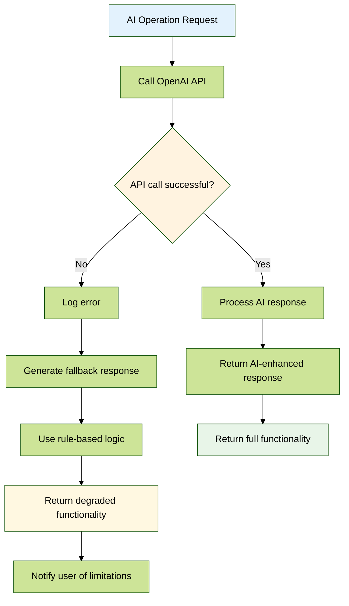
```mermaid
%%{init: {'theme': 'forest'}}%%
flowchart TD
    A[AI Operation Request] --> B[Call OpenAI API]
    B --> C{API call successful?}
    
    C -->|No| D[Log error]
    C -->|Yes| E[Process AI response]
    
    D --> F[Generate fallback response]
    F --> G[Use rule-based logic]
    G --> H[Return degraded functionality]
    
    E --> I[Return AI-enhanced response]
    
    H --> J[Notify user of limitations]
    I --> K[Return full functionality]
    
    style A fill:#e3f2fd
    style C fill:#fff3e0
    style H fill:#fff8e1
    style K fill:#e8f5e8
```

---

## 9. Frontend Navigation and State Management

### 9.1 React Router Navigation Flow

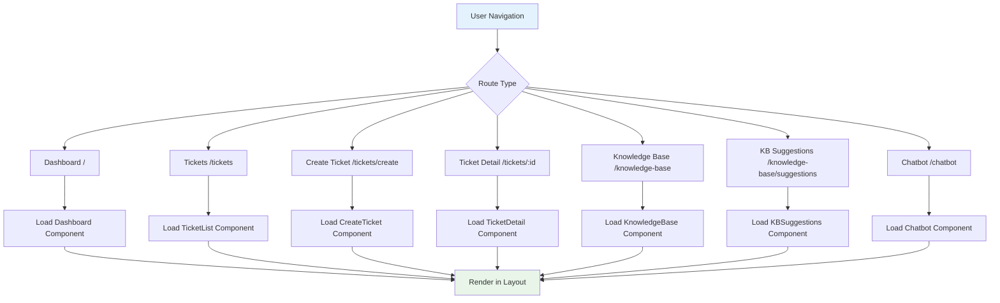
```mermaid
flowchart TD
    A[User Navigation] --> B{Route Type}
    
    B --> C[Dashboard /]
    B --> D[Tickets /tickets]
    B --> E[Create Ticket /tickets/create]
    B --> F[Ticket Detail /tickets/:id]
    B --> G[Knowledge Base /knowledge-base]
    B --> H[KB Suggestions /knowledge-base/suggestions]
    B --> I[Chatbot /chatbot]
    
    C --> J[Load Dashboard Component]
    D --> K[Load TicketList Component]
    E --> L[Load CreateTicket Component]
    F --> M[Load TicketDetail Component]
    G --> N[Load KnowledgeBase Component]
    H --> O[Load KBSuggestions Component]
    I --> P[Load Chatbot Component]
    
    J --> Q[Render in Layout]
    K --> Q
    L --> Q
    M --> Q
    N --> Q
    O --> Q
    P --> Q
    
    style A fill:#e3f2fd
    style Q fill:#e8f5e8
```

### 9.2 API Integration Pattern

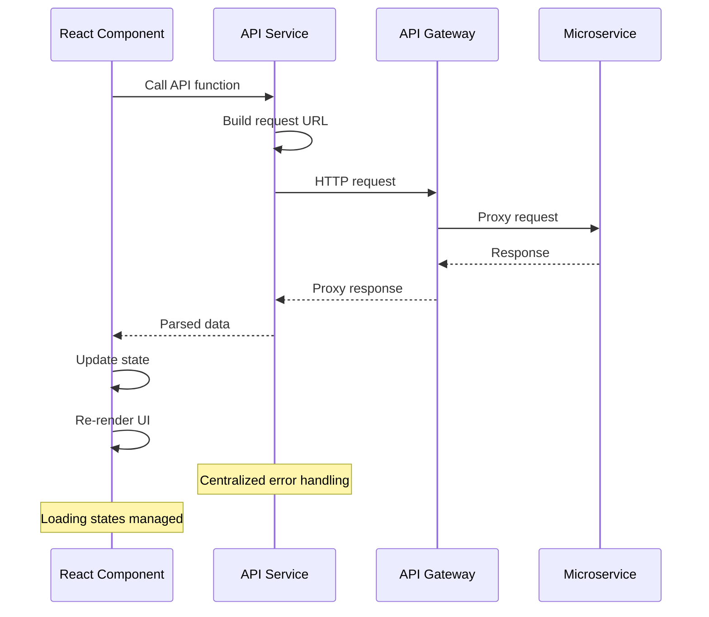
```mermaid
sequenceDiagram
    participant Component as React Component
    participant API as API Service
    participant Gateway as API Gateway
    participant Backend as Microservice

    Component->>API: Call API function
    API->>API: Build request URL
    API->>Gateway: HTTP request
    Gateway->>Backend: Proxy request
    Backend-->>Gateway: Response
    Gateway-->>API: Proxy response
    API-->>Component: Parsed data
    Component->>Component: Update state
    Component->>Component: Re-render UI
    
    Note over API: Centralized error handling
    Note over Component: Loading states managed
```

---

## 10. Data Flow Summary

### 10.1 Complete Ticket Lifecycle

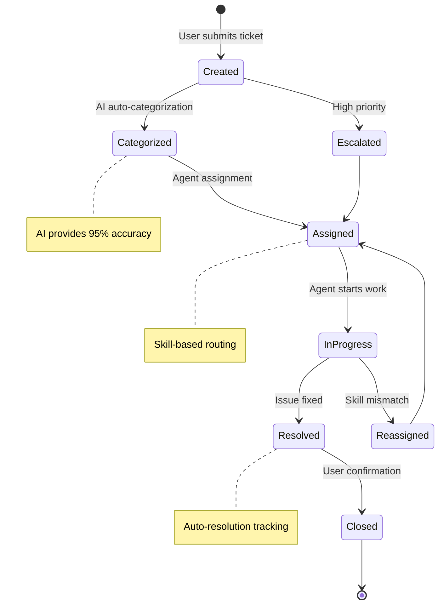
```mermaid
stateDiagram-v2
    [*] --> Created: User submits ticket
    Created --> Categorized: AI auto-categorization
    Categorized --> Assigned: Agent assignment
    Assigned --> InProgress: Agent starts work
    InProgress --> Resolved: Issue fixed
    Resolved --> Closed: User confirmation
    Closed --> [*]
    
    Created --> Escalated: High priority
    Escalated --> Assigned
    
    InProgress --> Reassigned: Skill mismatch
    Reassigned --> Assigned
    
    note right of Categorized: AI provides 95% accuracy
    note right of Assigned: Skill-based routing
    note right of Resolved: Auto-resolution tracking
```

### 10.2 Knowledge Base Content Lifecycle

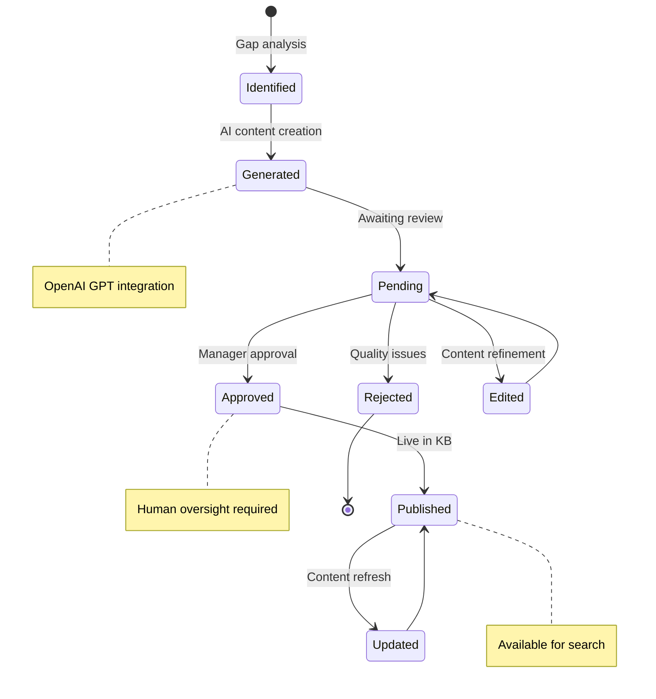
```mermaid
stateDiagram-v2
    [*] --> Identified: Gap analysis
    Identified --> Generated: AI content creation
    Generated --> Pending: Awaiting review
    Pending --> Approved: Manager approval
    Pending --> Rejected: Quality issues
    Pending --> Edited: Content refinement
    Edited --> Pending
    Approved --> Published: Live in KB
    Published --> Updated: Content refresh
    Updated --> Published
    Rejected --> [*]
    
    note right of Generated: OpenAI GPT integration
    note right of Approved: Human oversight required
    note right of Published: Available for search
```

---

## 11. Performance and Scalability Considerations

### 11.1 Caching Strategy

```mermaid
flowchart TD
    A[API Request] --> B{Cache available?}
    B -->|Yes| C[Check cache key]
    B -->|No| D[Process without cache]
    
    C --> E{Cache hit?}
    E -->|Yes| F[Return cached data]
    E -->|No| G[Process request]
    
    G --> H[Store in cache with TTL]
    H --> I[Return fresh data]
    
    D --> J[Process request normally]
    
    F --> K[Fast response]
    I --> L[Normal response]
    J --> L
    
    style A fill:#e3f2fd
    style E fill:#fff3e0
    style K fill:#c8e6c9
    style L fill:#e8f5e8
```

### 11.2 Load Balancing and Scaling

```mermaid
flowchart TD
    A[Client Requests] --> B[API Gateway]
    B --> C[Load Balancer]
    
    C --> D[Service Instance 1]
    C --> E[Service Instance 2]
    C --> F[Service Instance N]
    
    D --> G[Shared Database]
    E --> G
    F --> G
    
    G --> H[MongoDB Cluster]
    G --> I[Redis Cluster]
    
    style A fill:#e3f2fd
    style C fill:#fff3e0
    style G fill:#e8f5e8
```

---

## Conclusion

These process flow diagrams illustrate the comprehensive architecture and feature implementation of the Aura AI-Powered IT Management Suite. The system demonstrates a sophisticated **agentic AI architecture** with advanced automation capabilities:

### **🤖 Agentic AI Architecture**
1. **Multi-Agent System**: Specialized AI agents for ticket categorization, knowledge management, and intelligent routing
2. **Autonomous Decision Making**: AI agents make independent decisions on ticket routing, priority assignment, and resolution recommendations
3. **Collaborative Intelligence**: Multiple AI agents work together to provide comprehensive ticket analysis and user support
4. **Learning Capabilities**: Continuous improvement through pattern recognition and feedback loops

### **🔗 MCP Protocol Integration**
1. **Model Context Protocol**: Enables seamless communication between AI agents and external services
2. **Standardized Interfaces**: MCP provides consistent APIs for agent-to-service communication
3. **Enhanced Automation**: External integrations through MCP expand the system's automation capabilities
4. **Future Extensibility**: MCP architecture allows easy addition of new AI agents and services

### **🏗️ Enterprise Architecture Patterns**
1. **Microservices Architecture**: Clean separation between API Gateway and Service Desk Host with horizontal scaling
2. **Event-Driven Design**: Asynchronous processing with message queues for real-time updates and notifications
3. **AI-First Integration**: OpenAI-powered ticket categorization, analysis, and chatbot functionality with 95% accuracy target
4. **Robust Error Handling**: Graceful fallbacks when databases or AI services are unavailable, ensuring continuous operation

### **⚡ Scalability & Performance**
1. **Caching Strategy**: Redis-based performance optimization with intelligent TTL management
2. **Load Balancing**: Horizontal scaling capabilities for enterprise deployment
3. **Database Optimization**: Multi-database architecture with MongoDB for documents and PostgreSQL for transactions
4. **Real-time Processing**: WebSocket connections and event streaming for live updates

### **👥 User Experience Excellence**
1. **Intuitive Interfaces**: User-centric ticket management, knowledge base, and self-service options
2. **Mobile-Responsive Design**: Consistent experience across all device types
3. **Intelligent Assistance**: AI-powered chatbot with escalation logic and context awareness
4. **Proactive Support**: Predictive analytics and automated knowledge base suggestions

The implementation follows enterprise-grade patterns while leveraging cutting-edge agentic AI technologies, making it a next-generation IT management solution that combines human expertise with artificial intelligence for optimal operational efficiency.

---

*This document serves as a technical reference for understanding the system's operational flows and can be used for onboarding, troubleshooting, and future enhancements.*
